<div align="center">

# 🍽️ FoodAtlas

### Your global culinary compass for discovery and craft

A **recipe discovery & grocery-cart** mobile app built with **Flutter**, following **Clean Architecture (MVC)** — Firebase Auth, Cloud Firestore, light/dark theming and a fully Arabic (RTL) interface.

[](https://flutter.dev)
[](https://dart.dev)
[](https://firebase.google.com)
[](#)
[](#-license)

</div>

---

## 📸 Screenshots

<table>
  <tr>
    <td align="center">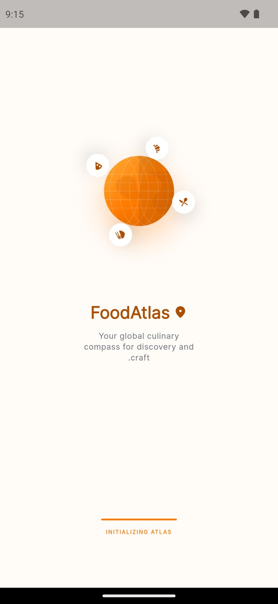<br/><b>Splash</b></td>
    <td align="center">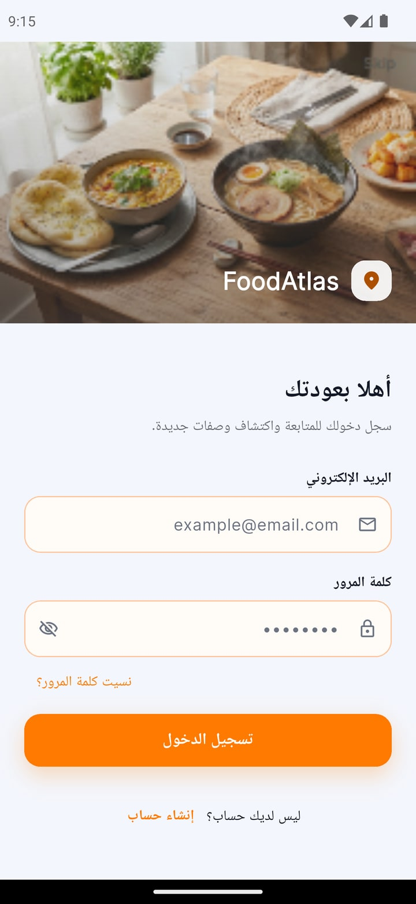<br/><b>Login</b></td>
    <td align="center">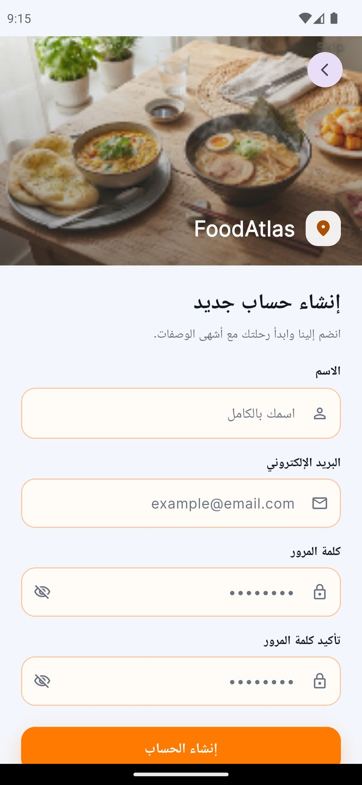<br/><b>Sign Up</b></td>
    <td align="center"><br/><b>Forgot Password</b></td>
  </tr>
  <tr>
    <td align="center">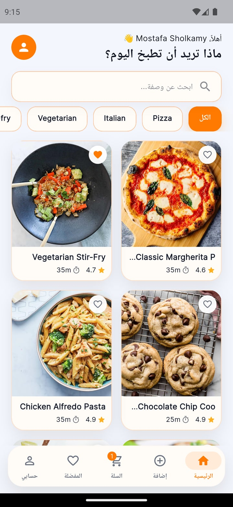<br/><b>Home</b></td>
    <td align="center">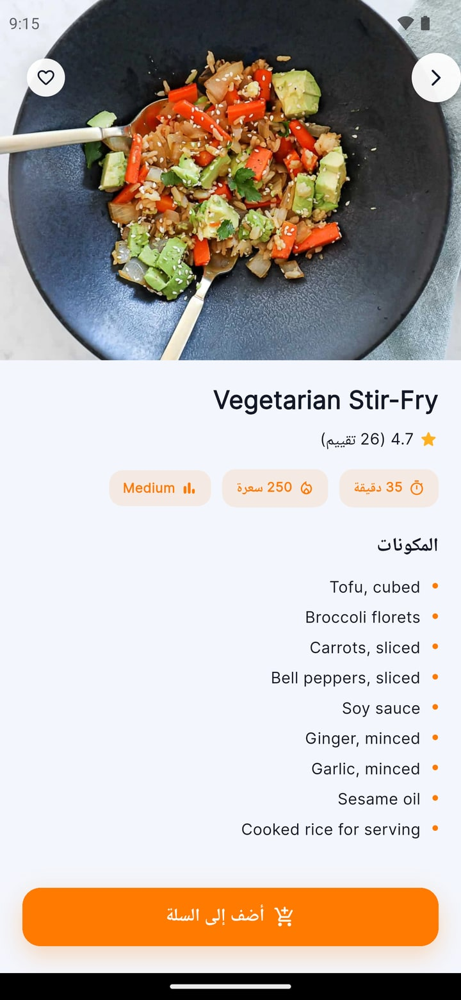<br/><b>Recipe Details</b></td>
    <td align="center">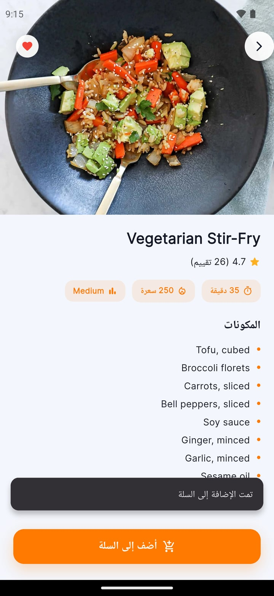<br/><b>Add to Cart</b></td>
    <td align="center">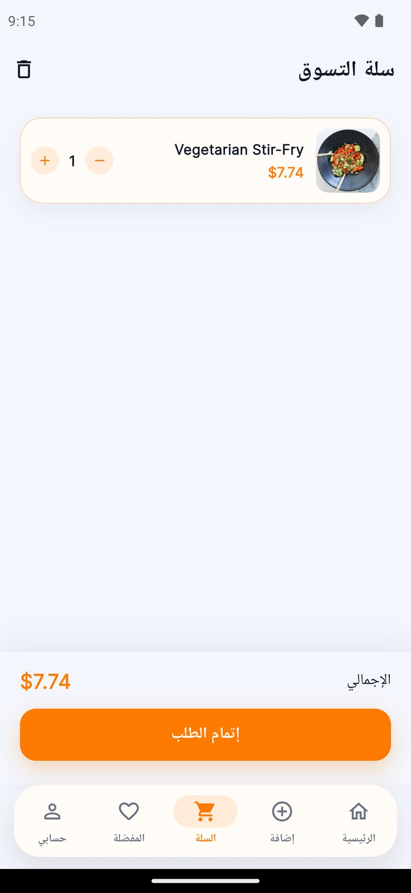<br/><b>Cart</b></td>
  </tr>
  <tr>
    <td align="center">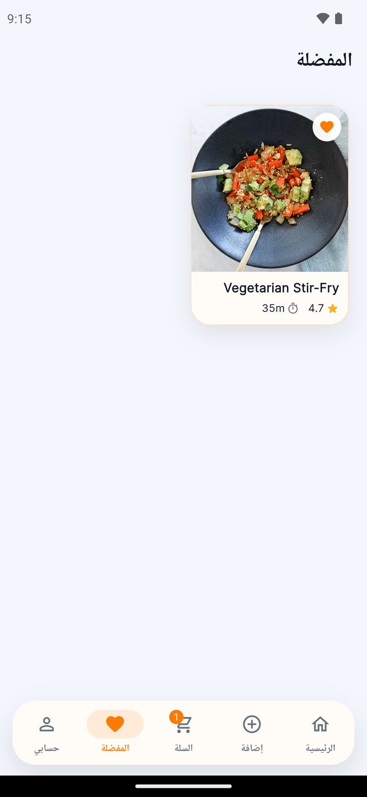<br/><b>Favorites</b></td>
    <td align="center">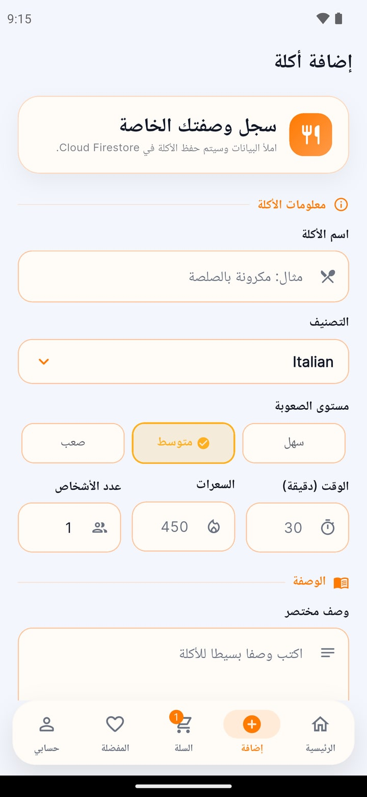<br/><b>Add Recipe</b></td>
    <td align="center">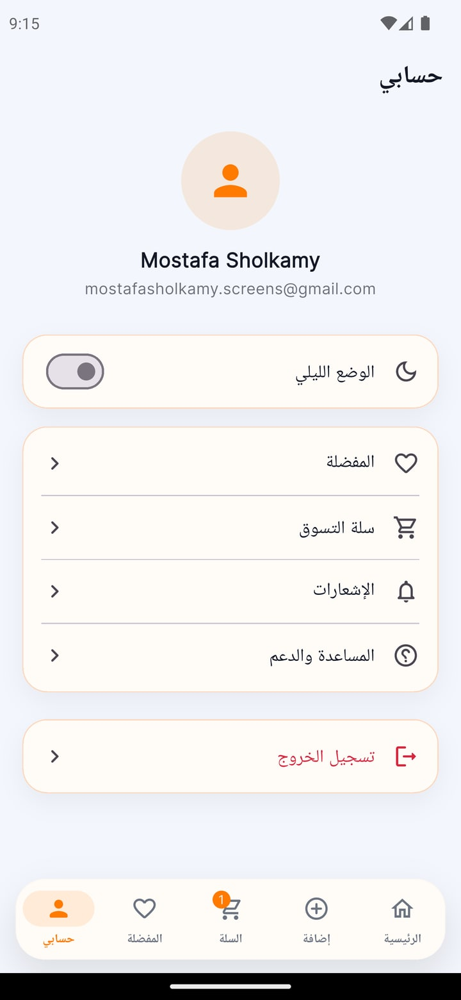<br/><b>Profile</b></td>
    <td align="center">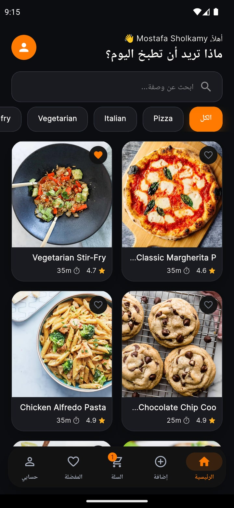<br/><b>Dark Mode</b></td>
  </tr>
</table>

---

## ✨ Features

| | Feature | Description |
|---|---------|-------------|
| 🔐 | **Authentication** | Sign up, login and password reset with **Firebase Auth** (Email/Password) |
| 🍲 | **Recipe Discovery** | Real recipes with images, ratings, calories & difficulty from a public API |
| 🔎 | **Search & Categories** | Live search + category filter chips |
| ❤️ | **Favorites** | Save recipes, persisted locally between sessions |
| 🛒 | **Cart** | Add/remove items, adjust quantity, live total |
| ➕ | **Add Your Own Recipe** | Create custom meals saved to **Cloud Firestore** |
| 🌗 | **Light / Dark Theme** | Complete theming with a persisted toggle |
| 🌍 | **Arabic RTL UI** | Fully localized right-to-left interface |
| 💾 | **Local Persistence** | SharedPreferences keeps theme, favorites & cart across restarts |

---

## 🛠️ Tech Stack

| Layer | Technology |
|-------|------------|
| **Framework** | Flutter 3.44 · Dart 3.3+ |
| **State Management** | Provider (MVC — `ChangeNotifier` controllers) |
| **Architecture** | Clean Architecture — `data` / `domain` / `presentation` |
| **Auth & Backend** | Firebase Auth · Cloud Firestore |
| **Networking** | Dio |
| **Local Storage** | SharedPreferences |
| **UI** | Google Fonts · Shimmer · Cached Network Image · flutter_svg |
| **Utils** | Equatable · intl |

---

## 🏗️ Architecture

The project follows **Clean Architecture combined with MVC**. Every feature is isolated into layers so that UI, business logic and data sources never leak into each other:

```
lib/
├── core/                         # Shared, cross-feature code
│   ├── theme/                    # AppColors, AppTheme, ThemeController
│   ├── constants/                # API URLs, storage keys, sizes, strings
│   ├── services/                 # LocalStorageService, FirebaseAuthService
│   ├── network/                  # ApiClient (Dio)
│   ├── widgets/                  # Reusable Button, TextField, Loading/Error/Empty
│   └── routes/                   # AppRoutes
│
├── features/
│   ├── splash/                   # Animated splash screen
│   ├── auth/                     # Login · Sign Up · Forgot Password
│   │   ├── data/                 # UserModel, AuthRepositoryImpl
│   │   ├── domain/               # AuthRepository (contract)
│   │   ├── controller/           # AuthController
│   │   └── view/                 # Screens
│   ├── home/                     # Home feed (remote API)
│   │   ├── data/                 # RecipeModel, RemoteDataSource, RepositoryImpl
│   │   ├── domain/               # RecipeRepository (contract)
│   │   ├── controller/           # HomeController
│   │   ├── view/                 # HomeScreen (nav shell), HomeTab, RecipeDetailsScreen
│   │   └── widgets/              # RecipeCard, CategoryChip
│   ├── favorites/                # Favorites (local storage)
│   ├── cart/                     # Shopping cart (local storage)
│   ├── add_meal/                 # Add custom recipe (Firestore)
│   └── profile/                  # Profile · theme toggle · logout
│
├── main.dart                     # Entry point + DI (MultiProvider)
├── app.dart                      # MaterialApp + themes + routes
└── firebase_options.dart         # Firebase config (generated by flutterfire)
```

**Why this structure?**
- **`domain`** holds the repository *contracts* (pure Dart, no Flutter) → the business rules never depend on any SDK.
- **`data`** holds the *implementations* (Dio / Firebase / SharedPreferences) → swapping the data source only touches this layer.
- **`controller`** is the MVC controller (`ChangeNotifier`) → the only bridge between data and UI.
- **`view`** is a dumb widget layer that reacts to the controller via `Provider`.

---

## 🚀 Getting Started

### 1. Prerequisites
- Flutter SDK `3.3+`
- A Firebase project (for Auth & Firestore)

### 2. Install dependencies
```bash
flutter pub get
```

### 3. Connect your own Firebase project
The app ships with Firebase Auth wired up. To point it at **your** project:

1. Create a project on the [Firebase Console](https://console.firebase.google.com/).
2. Enable **Authentication → Sign-in method → Email/Password**.
3. Create a **Cloud Firestore** database (for the "Add Recipe" feature).
4. Install the CLI and generate the config:
   ```bash
   dart pub global activate flutterfire_cli
   flutterfire configure
   ```
   This regenerates `lib/firebase_options.dart` and adds the native config files for Android & iOS.

### 4. Run
```bash
flutter run
```

> If Firebase isn't configured yet, the app still runs — only the auth and add-recipe screens will report errors until you connect a project.

---

## 📡 API

Recipes are fetched from the free, key-less public API **[dummyjson.com/recipes](https://dummyjson.com/recipes)**:

| Endpoint | Used by |
|----------|---------|
| `GET /recipes` | Home feed |
| `GET /recipes/search?q=...` | Search |
| `GET /recipes/tags` | Category chips |
| `GET /recipes/:id` | Recipe details |

The data source is fully isolated in
`lib/features/home/data/datasources/recipe_remote_datasource.dart`
and `lib/core/constants/app_constants.dart`. Swap the base URL and **no** controller or view needs to change.

---

## 🎨 Theming

A complete **Light / Dark** design system (colors, inputs, cards, bottom navigation). The toggle lives on the **Profile** screen and is persisted automatically via SharedPreferences.

---

## 📝 Notes

- Prices in the cart are **estimated from calories**, since the public API provides no pricing — they can be wired to a real source following the same pattern.
- All in-app text is **Arabic** with **RTL** enabled by default.

---

## 🌍 نبذة بالعربية

**FoodAtlas** تطبيق وصفات وتسوّق مكونات مبني بـ **Flutter** على **Clean Architecture + MVC**:

- **المصادقة**: تسجيل دخول / إنشاء حساب / استعادة كلمة المرور عبر **Firebase Auth**.
- **الوصفات**: بيانات حقيقية من API عام (صور، تقييمات، سعرات، مستوى صعوبة) + بحث وتصنيفات.
- **المفضلة والسلة**: محفوظتان محليًا وتبقيان بعد إغلاق التطبيق.
- **إضافة وصفة**: تُحفظ في **Cloud Firestore**.
- **الوضع الليلي/النهاري**: ثيم كامل مع حفظ الاختيار.
- **الواجهة**: عربية بالكامل مع دعم RTL.

كل Feature مقسّم إلى `data` / `domain` / `controller` / `view` — فصل تام بين الواجهة ومنطق العمل ومصادر البيانات.

---

## 👤 Author

**Mostafa Sholkamy** — Flutter Developer

- GitHub: [@mostafasholkamy](#)
- Portfolio: [mostafa-portfolio.pages.dev](https://mostafa-portfolio.pages.dev)

---

## 📄 License

This project is released under the **MIT License** — free to use, learn from and build upon.
